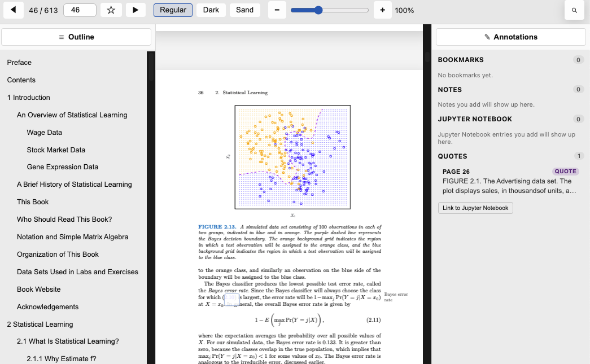
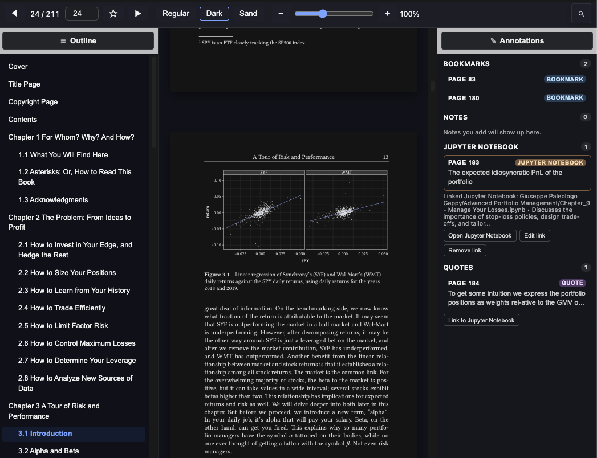
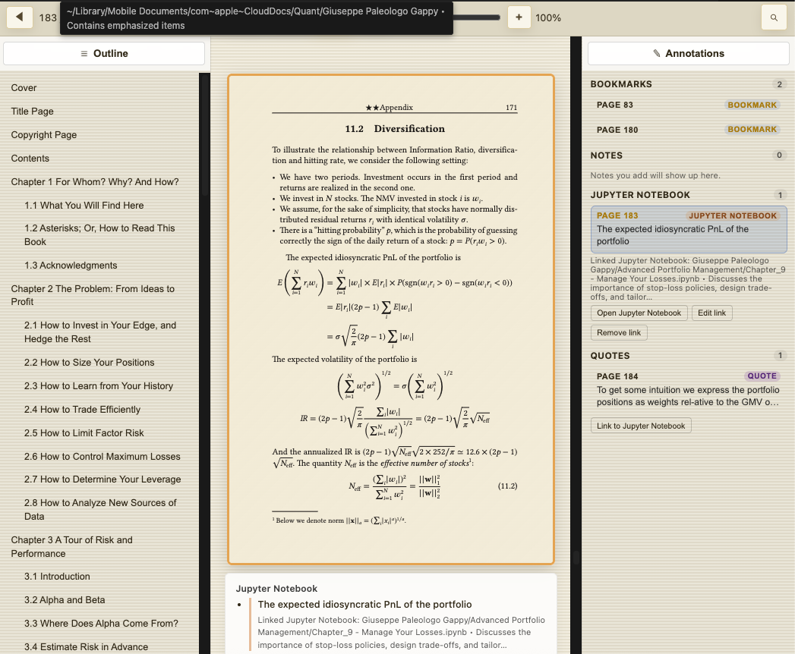
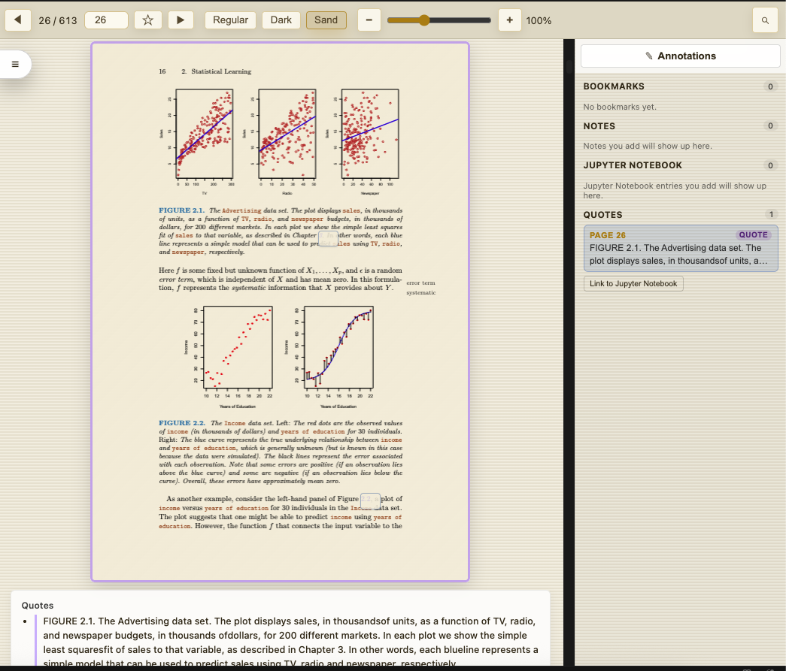
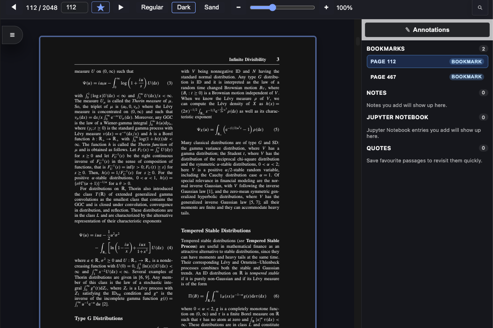
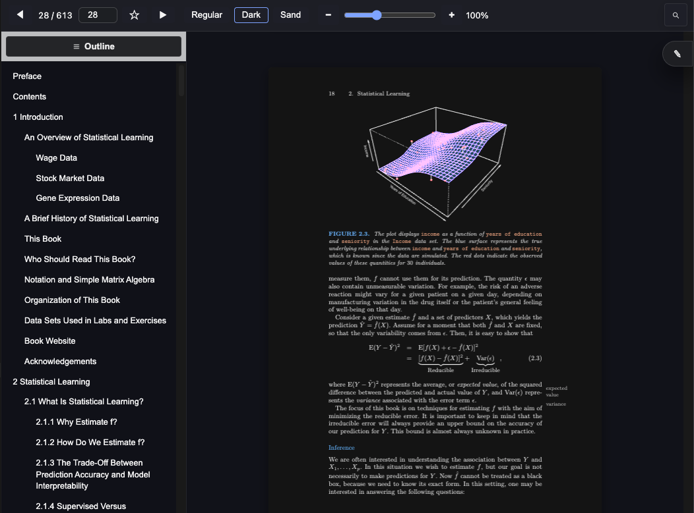

# DunkelPDF - The Definitive PDF Reader for Data Science

DunkelPDF Reader brings calm, consistent PDF study tools into Visual Studio Code so you can comb through resea
rch papers, reports, and notebooks without leaving your workflow. Open a document and you will find a focused interface that keeps
the page front and centre while giving you quick controls for themes, zoom, annotations, and exports back into Markdown notes.

## Quick start
1. Open the **Extensions** view in VS Code (`Ctrl` + `Shift` + `X` / `Cmd` + `Shift` + `X`).
2. Search for **Definitive PDF Reader for Data Science** and click **Install**.
3. Open any `.pdf` file. When prompted, choose **Definitive PDF Reader for Data Science** as the editor (you can make it the defaul
t via **Open With…**).

## Feature tour

### Themes and focus modes
- Switch between Regular, Dark, and Sand themes straight from the toolbar to match lab lighting or late-night reading. Global
  commands such as `Dunkel PDF: Use Regular Theme`, `…Dark Theme`, and `…Sand Theme` remain available in the Command Palette to appl
y a theme to every open viewer simultaneously.
- Use the zoom slider for quick scaling between 50 % and 200 %; the percentage readout updates in real time to keep your spatial
  awareness intact.

### Bookmarking & annotation workflow
- Right-click anywhere on a page to open the annotation context menu. Choose **Add note** or **Add quote** to pin insights to the
  current page, **Remove note** or **Remove quote** to tidy them up, **Toggle favourite** to bookmark the page, or **Copy page text**
  to pull the underlying text into your clipboard when available.
- An annotation column appears beside any page with saved notes or quotes, letting you skim highlights while you read. Everything
  is written to a Markdown companion file (`<document>.dk.md`) next to your PDF so the research trail stays portable, searchable, a
  nd editable.
- The bookmark button in the toolbar mirrors the context-menu favourite toggle, making it easy to mark key figures or tables as
  you work.

### Search overlay
- The search toolbar (`toolbar__search*` handlers in `media/viewer.js`) opens with familiar shortcuts so you can step through mat
  ches, highlight all occurrences, and jump directly to the most relevant paragraph without losing your place.

### Outline navigator
- Outline helpers (`outline*` utilities) build a live table of contents from PDF metadata so you can hop between sections, appendi
  ces, or methodology notes without scrolling through every page.

### Virtualization for large PDFs
- Behind the scenes, the `virtualizationState` logic streams pages in and out of view, keeping navigation smooth even when you lo
  ad multi-hundred-page theses or regulation binders.

### Link and footnote previews
- Link activation taps into `handleAnnotationActivation` to open external references safely in your browser, while `extractFootno
  teTooltip` produces hover previews so you can peek at citations without breaking concentration.

### Copy to clipboard support
- Use the toolbar controls or context menu to copy the current page, highlighted text, or quote snippets directly to your clipbo
  ard for quick transfer into notebooks, issues, or chat threads.

## Image demos
Add screenshots below to showcase different workflows:

- 
- 
- 
- 
- 
- 

## Requirements
- Visual Studio Code **1.85.0** or newer
- No additional dependencies needed

## Need help?
Open an issue in the repository or contact the publisher through the VS Code Marketplace listing. Feedback on accessibility, read
ability, or new feature ideas is always welcome.

## License
Definitive PDF Reader for Data Science is released under the [MIT License](LICENSE).
